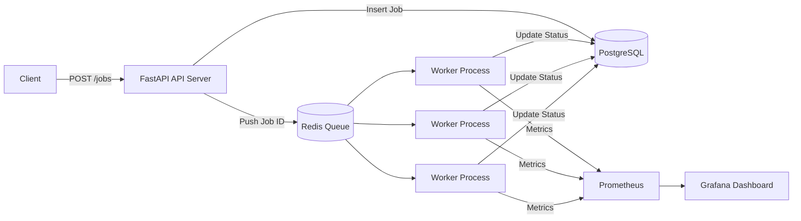

# Architecture — Distributed Job Processing System (DJPS)

## 1. High-Level Architecture

```
Client (HTTP)
     │
     ▼
┌─────────────────────────────┐
│  FastAPI API Server         │  POST /jobs, GET /jobs, GET /dlq, GET /metrics
│  • Rate limiting (slowapi)  │
│  • Idempotency enforcement  │
│  • Pydantic validation      │
└──────────┬──────────────────┘
           │ write job row            │ read job status
           ▼                          ▼
┌─────────────────┐        ┌──────────────────────┐
│   PostgreSQL    │        │  Redis               │
│   (jobs table)  │        │  main_queue          │
│                 │        │  dead_letter_queue   │
│  Persists:      │        │  heartbeat:{id} keys │
│  • metadata     │        └──────────┬───────────┘
│  • status       │                   │ BRPOP
│  • retry count  │                   ▼
│  • timestamps   │        ┌──────────────────────┐
└─────────────────┘        │  Worker Pool         │
         ▲                 │  (multiprocessing)   │
         │ status updates  │                      │
         └─────────────────┤  Per-worker:         │
                           │  • execute job       │
                           │  • retry / backoff   │
                           │  • heartbeat         │
                           │  • stuck-job scan    │
                           └──────────────────────┘
                                      │
                                      ▼
                           ┌──────────────────────┐
                           │  Prometheus + Grafana│
                           │  (port 9090 / 3000)  │
                           └──────────────────────┘
```

---

## 2. High-Level Flow



---

## 3. Core Components

### 3.1 API Server (FastAPI)

The API layer is a **pure HTTP adapter**. Routes validate the request shape, call service-layer functions, and convert service exceptions to HTTP status codes. No database queries or queue operations live in the route handlers.

Responsibilities:
- Accept job creation requests via `POST /jobs`
- Validate payload using Pydantic v2
- Enforce per-IP rate limiting (10 req/min, via slowapi + SlowAPIMiddleware)
- Delegate to `job_service.create_job()` — idempotency check, DB insert, Redis enqueue
- Expose `GET /jobs/{id}` and `GET /jobs` (paginated, filterable)
- Expose `GET /dlq` via `dlq_service.get_dlq_jobs()`
- Expose `GET /metrics` (Prometheus text format)

---

### 3.2 Service Layer

All business logic lives in `app/services/`. Routes are forbidden from importing the `Job` model, query functions, or `enqueue_job` directly. This enforces a strict separation:

```
Route  →  Service  →  Repository (ORM / Redis)
```

| Module | Responsibility |
|---|---|
| `job_service.py` | create, read, list jobs; idempotency; metrics inc; enqueue |
| `dlq_service.py` | read DLQ from Redis; resolve job rows from Postgres |
| `retry_service.py` | increment retry_count; schedule delayed requeue; route to DLQ |
| `backoff.py` | `calculate_backoff(n)` — `min(base ** n, max_backoff)` |
| `job_executor.py` | simulate the actual work (HTTP call to httpbin) |

---

### 3.3 PostgreSQL (Persistent Storage)

**Table: `jobs`**

| Column | Type | Notes |
|---|---|---|
| `id` | UUID | Primary key, auto-generated |
| `payload` | JSONB | Arbitrary job data |
| `status` | ENUM | `queued / processing / completed / failed` |
| `retry_count` | INTEGER | Incremented on each failed attempt |
| `idempotency_key` | VARCHAR | UNIQUE — enforced at DB level |
| `created_at` | TIMESTAMP | Server default `now()` |
| `updated_at` | TIMESTAMP | Server default + `onupdate` |
| `last_attempt_at` | TIMESTAMP | Set when worker picks up the job |

**Indexes (Alembic migration `a1b2c3d4e5f6`):**

| Index | Purpose |
|---|---|
| `idx_jobs_status` | Filter and count by status |
| `idx_jobs_created_at` | Default sort order for `GET /jobs` |
| `idx_jobs_status_created_at` | Composite — filtered + sorted list queries |
| `idx_jobs_last_attempt_at` | Stuck-job recovery scan |

PostgreSQL is the **source of truth**. If Redis loses its queue contents the recovery script re-enqueues all `queued` jobs by querying the database.

---

### 3.4 Redis (Queue Layer)

| Key | Structure | Usage |
|---|---|---|
| `main_queue` | Redis list | RPUSH (producer) / BRPOP (worker) |
| `dead_letter_queue` | Redis list | RPUSH by retry_service when retries exhausted |
| `heartbeat:{worker_id}` | String with TTL | Written every loop cycle; expires in 30 s |

**Why Redis for queuing?**

Redis `BRPOP` gives blocking pop with a timeout — the worker blocks cheaply until a job appears rather than busy-polling. Job IDs (not full payloads) are stored in Redis; the full payload is always fetched from Postgres so data is never lost if Redis restarts.

---

### 3.5 Worker Pool

Workers are spawned as separate **OS processes** via Python `multiprocessing`. Each process runs `process_jobs()` in a tight loop:

```
┌─────────────────────────────────────────────┐
│  loop:                                       │
│    if shutdown_event.is_set(): break         │
│    update_heartbeat()                        │
│    every N cycles: requeue_stuck_jobs()      │
│    job_id = BRPOP(timeout=5)                 │
│    if None: continue                         │
│    fetch Job from Postgres                   │
│    set status = processing                   │
│    execute_job(job_id)                       │
│    set status = completed                    │
│    on exception: handle_job_failure()        │
└─────────────────────────────────────────────┘
```

**Graceful shutdown:** `SIGTERM` sets a `threading.Event`. The worker checks the flag at the top of each iteration — after completing any in-progress job — so no work is abandoned mid-execution.

---

### 3.6 Retry Strategy

```
retry_delay = min(backoff_base ** retry_count, max_backoff)
```

Defaults: `2^0=1 s`, `2^1=2 s`, `2^2=4 s`, ceiling `60 s`.

After `max_job_retries` (default 3) failed attempts the job status is set to `failed` and its ID is pushed to `dead_letter_queue`.

---

### 3.7 Idempotency

1. Client sends `idempotency_key` (optional string) with the job creation request.
2. **Fast path:** before inserting, the service queries for an existing row with that key and returns it immediately if found.
3. **Race condition path:** two concurrent requests with the same key both pass the fast path check simultaneously. One INSERT succeeds; the other gets an `IntegrityError` (UNIQUE constraint). The loser rolls back and re-queries, returning the winner's row.
4. **Unrecoverable collision:** if the rollback + re-query still finds nothing (extremely unlikely), `DuplicateIdempotencyKeyError` is raised → HTTP 409.

---

### 3.8 Stuck-Job Recovery

Every `stuck_check_interval` (default: 10) worker loop cycles, the worker calls `requeue_stuck_jobs()`, which:

1. Queries for all jobs where `status = 'processing'` AND `last_attempt_at < now() - stuck_job_threshold seconds`.
2. Resets each such job's status back to `queued` and pushes its ID back onto `main_queue`.

This handles the crash scenario: if a worker dies mid-job, the job will be requeued by another worker's recovery scan.

---

### 3.9 Observability

| Counter | Incremented when |
|---|---|
| `jobs_created_total` | `job_service.create_job()` succeeds |
| `jobs_completed_total` | Worker marks job `completed` |
| `jobs_failed_total` | Job sent to DLQ (retries exhausted) |
| `jobs_retried_total` | Retry attempt scheduled |

Prometheus scrapes `/metrics` (prometheus-client text format). Grafana reads from Prometheus and renders time-series panels.

Every log entry is newline-delimited JSON (`python-json-logger`). `job_id` and `worker_id` are injected via `contextvars.ContextVar` so every message during a job's lifecycle carries the same correlation IDs without being passed explicitly.

---

## 4. System Guarantees

The system provides the following guarantees:

**At-least-once execution**
Jobs may be retried after failure but will never be silently dropped.

**Idempotent submission**
Duplicate job submissions with the same `idempotency_key` return the same job record and do not create additional jobs.

**Crash recovery**
If a worker crashes while processing a job, the stuck-job scanner requeues it after the configured threshold.

**Graceful shutdown**
Workers finish in-progress jobs before exiting, preventing partial execution.

**Durable state**
Job metadata is persisted in PostgreSQL; Redis stores only queue pointers.

---

## 5. Architecture Decisions & Trade-offs

### Decision 1: Synchronous workers (multiprocessing) instead of asyncio tasks

**Chosen:** Python `multiprocessing.Process` — one OS process per worker.

**Trade-off:** Higher memory per worker vs. the alternative of `asyncio` tasks. Processes bypass the GIL, so CPU-bound work genuinely runs in parallel. Since each worker makes a real HTTP call (blocking I/O), threads or async tasks would also work; processes were chosen for simplicity and to avoid asyncio complexity in the worker logic.

**Alternative considered:** Celery — rejected because it adds a broker abstraction layer, a Beat scheduler, and significant operational overhead for a project this size. Using Redis + `BRPOP` directly gives the same semantics with less complexity.

---

### Decision 2: PostgreSQL as source of truth, Redis as queue-only

**Chosen:** Job data lives entirely in Postgres. Redis stores only `job_id` strings in its queues.

**Trade-off:** Each worker job pick-up requires one extra Postgres query (fetch the full row). This is acceptable because the bottleneck is the job's actual execution time, not the DB round-trip.

**Benefit:** If Redis is restarted or evicted, no job data is lost. A one-time migration script can re-enqueue all `queued` jobs from Postgres.

---

### Decision 3: Synchronous SQLAlchemy (psycopg2) over async (asyncpg)

**Chosen:** SQLAlchemy 2.0 with `psycopg2-binary` in sync mode.

**Trade-off:** The FastAPI server is technically async, but the DB session dependency (`get_db`) runs synchronously, which blocks the event loop during DB calls. For this project's throughput requirements this is not a bottleneck — the API endpoints are lightweight (single-row lookups and inserts).

**Alternative:** `asyncpg` + `SQLAlchemy async session` would be needed at high concurrency (>1000 concurrent API requests). Not worth the added complexity for this use case.

---

### Decision 4: Separate service layer from routes

**Chosen:** Routes are pure HTTP adapters; all business logic (DB queries, queue operations, metrics) lives in `app/services/`.

**Benefit:** Service functions are testable in pure unit tests without a running HTTP server. Routes can be swapped (e.g., to a gRPC interface) without touching business logic. Exceptions are translated at the boundary — the service raises `DuplicateIdempotencyKeyError`; the route converts it to HTTP 409.

---

### Decision 5: Rate limiting per IP, not per authenticated user

**Chosen:** slowapi with `get_client_ip()` as the key function.

**Trade-off:** Shared NAT / proxy setups can cause false throttling for multiple legitimate users behind one IP. Authentication was explicitly out of scope for this project.

---

## 6. Scaling Approach

### Horizontal scaling — API server

The API server is stateless. Run multiple instances behind a load balancer (nginx, AWS ALB, etc.). Rate-limit state stored in Redis (slowapi supports a Redis backend) so limits are enforced cluster-wide.

### Horizontal scaling — Workers

Increase `NUM_WORKERS` (environment variable) to add more processes on a single host, or deploy workers to additional hosts. Because workers consume from a single Redis list with `BRPOP`, no coordination is needed — Redis serialises access automatically.

### Database scaling

- **Read replicas** for `GET /jobs` list queries (don't need the primary).
- **Connection pooling** via PgBouncer in front of Postgres.
- **Partitioning** the `jobs` table by `created_at` if the table grows to tens of millions of rows.

### Queue scaling

- Upgrade from a single Redis list to **Redis Streams** (`XADD / XREADGROUP`) if consumer-group semantics (per-consumer acknowledgement, replay) are needed.
- Replace Redis with **RabbitMQ** or **Kafka** if fan-out to multiple service types or guaranteed ordering across partitions becomes a requirement.

### Observability at scale

- Add a **queue depth gauge** (`LLEN main_queue`) to Prometheus so autoscalers can trigger on backlog size.
- Emit per-job latency histograms (time from `created_at` to `completed_at`) for SLO tracking.

---

## 7. Failure Scenarios

### Worker crash during job execution
If a worker terminates mid-job, the job remains in `processing` state.  
The stuck-job recovery scan detects jobs where `last_attempt_at` exceeds the threshold and requeues them.

### Redis restart
Redis only stores job IDs. If Redis loses its queue state, a recovery script can re-enqueue all jobs with status `queued` from PostgreSQL.

### Database restart
Workers fail to fetch jobs temporarily but retry on the next loop iteration once the database becomes available.

### Duplicate client submission
The database UNIQUE constraint on `idempotency_key` prevents duplicate job creation even under concurrent requests.